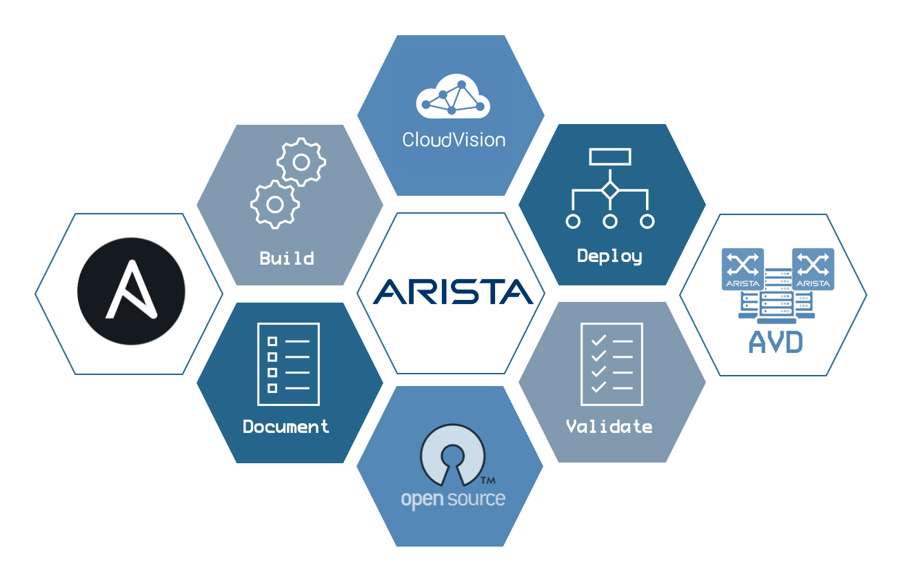
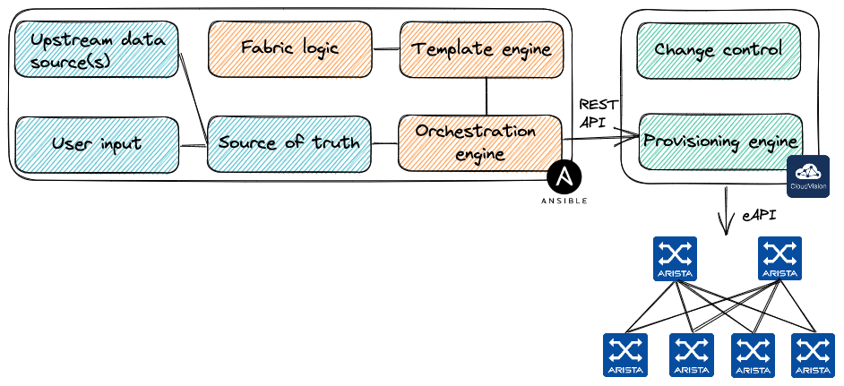

# Ansible in a Devcontainer

<!-- Do not add page number on this slide -->
<!--
_paginate: false
-->

```text
Entire arista.avd ecosystem in a sealed bottle

Petr Ankudinov
Patrick Mathy
                                          2023
```



---

# $ whoami

<style scoped>section {font-size: 18px;}</style>

<!-- Add footer starting from this slide -->
<!--
footer: ''
-->

- Petr Ankudinov [github.com/ankudinov](https://github.com/ankudinov)

  - Advanced Services Engineer at Arista Networks
  - Over 20 years of experience in IT with a bit of everything
  - ACE: L5, CCIE 37521
  - Passionate DC and network automation engineer
  - Daily (and nightly) user of Ansible, VSCode and more

- Patrick Mathy
  
  - Arista Systems Engineering at Arista Networks
  - Networking around since 2016
  - ACE: L5, CCIE 57751
  - R&S, DC, Python, Ansible, Terraform, DevNet


---

# Agenda

<style scoped>section {font-size: 22px;}</style>


- Ansible AVD collection overview
- Common challenges when building Ansible environment for network automation
- Why devcontainers?
- Pre-building a devcontainer with [arista.avd](https://avd.arista.com/), docker-in-docker and Containerlab using Github [devcontainers/ci@v0.3](https://github.com/devcontainers/ci) action.
- How to run the container on any machine (with docker run or as devcontainer) or Github Codespaces

> ```text
> Tech level: intermediate
>   know some Ansible, VSCode,
>   containers, Github, etc.
> ```

---

# Credits and References

<style scoped>section {font-size: 22px;}</style>

<!-- Add footer starting from this slide -->
<!--
footer: ''
-->

This repository is based on many awesome open source repositories and some free/commercial Github features:

- [VS Code](https://code.visualstudio.com/)
- [DevContainers](https://code.visualstudio.com/docs/remote/containers)
- [Marp](https://marp.app/)
- [Excalidraw VS Code Plugin](https://github.com/excalidraw/excalidraw-vscode)
- [Github Actions](https://github.com/features/actions)
- [Github Pages](https://pages.github.com/)
- [Github Codespaces](https://github.com/features/codespaces)
- [Carbon](https://carbon.now.sh/)
- And many more...

All photos are taken from [Pexels](https://www.pexels.com/) and [Unsplash](https://unsplash.com/). Excellent free stock photos resources. It's not possible to reference every author individually, but their work is highly appreciated.

---

# What is Ansible AVD?

<style scoped>section {font-size: 20px;}</style>



- [AVD](https://avd.arista.com/) stands for Arista Validated Design as it was based on the [EVPN Deployment Guide](https://www.arista.com/custom_data/downloads/?f=/support/download/DesignGuides/EVPN_Deployment_Guide.pdf)
- A very successful community project used to deploy EVPN based Data Center fabrics
  - Over [200 stars on Github](https://github.com/aristanetworks/ansible-avd) and 79 contributors as of Sep 2023
  - The most active Arista collection on [Ansible Galaxy](https://galaxy.ansible.com/arista/avd)
- High level workflow:
  - Define abstracted group/host vars using AVD data model
  - Generate low level device specific variables (aka structured configs)
  - Parse templates, build plain text configs
  - Deliver configs to network devices using Ansible `arista.eos.eos_config`

---

# Running Ansible in a Container

<style scoped>section {font-size: 20px;}</style>


- The old story of "it works on my machine":
  - Different versions of Python and Ansible
  - Dependencies
  - Interpreter path issues
  - The famous very-very-very-**VERY** verbose only to find out that:
    `The error appears to be, but may be elsewhere` (c) Ansible 😅
  
    > The error handling and input validation is a very significant part of the `ansible.avd` collection.

- Containers help to solve the issues above. But bring new challenges and not always easy to build and use.

---

# What It Takes to Build a Good Container?

<style scoped>section {font-size: 18px;}</style>


- Craft a Dockerfile with some essentials.
- Add a non-root user, as root breaks permissions, breaks Ansible and ruins your work-life balance 😎.
- Match user ID inside and outside of the container. Some operating systems like RHEL and the family are very strict about it. This is not a trivial task.
- Create an entrypoint.
- Take care of transferring Git credentials, keys, etc. into the container (if it's interactive).
- Think about security and maintaining the container repository.
- ... and it has to be multi-platform: amd64 and arm64 as a minimum.

And now convince someone to run it. :ninja: ➡️

---

# Dev Container - A Better Container

<style scoped>section {font-size: 20px;}</style>


- [A Dev Container](https://containers.dev) is a container used as a fully featured development environment. Dev containers can be run locally or remotely, in a private or public cloud, in a variety of [supporting tools and editors](https://containers.dev/supporting).
- [Dev Container Specification](https://github.com/devcontainers/spec) was started by Microsoft and has strong community support.
- Dev Containers are powered by:
  - [Prebuilt images](https://github.com/devcontainers/images)
  - [Features](https://containers.dev/features)

> **Dev Container features** enable complex functionality at the cost a few lines added to `devcontainer.json`

---

# Prebuilt Dev Containers

<style scoped>section {font-size: 20px;}</style>


- Building a dev container locally may not be optimal and increases the risk of changing dependencies.
- You can pre-built your own dev container and upload to any container registry.
- One of the best combos:
  - [Github Container Registry](https://github.blog/2020-09-01-introducing-github-container-registry/)
  - [devcontainers/ci@v0.3](https://github.com/devcontainers/ci) action

---

# The Demo

<style scoped>section {font-size: 20px;}</style>


- The demo is showing a single use case of building a functional EVPN lab in a dev container with Ansible AVD
- The use cases are endless
- Dev containers are not intended to be used in prod theoretically, but in certain cases this can be very acceptable

---

<style scoped>section {font-size: 60px;}</style>


# Q&A
