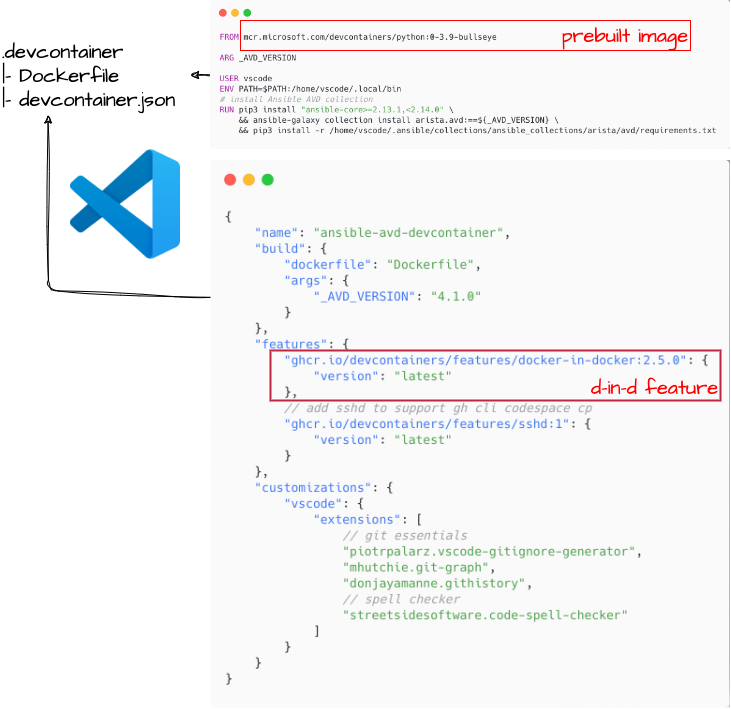
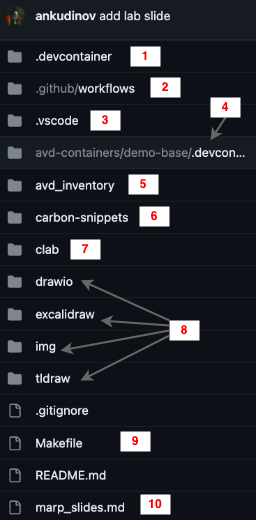

# Ansible in a Devcontainer

<!-- Do not add page number on this slide -->
<!--
_paginate: false
-->

```text
Entire arista.avd ecosystem in a sealed bottle

Petr Ankudinov
Patrick Mathy
                                      Sep 2023
```


---

# $ whoami

<style scoped>section {font-size: 18px;}</style>

<!-- Add footer starting from this slide -->
<!--
footer: ''
-->

- Petr Ankudinov [github.com/ankudinov](https://github.com/ankudinov)

  - Advanced Services Engineer at Arista Networks
  - Over 20 years of experience in IT with a bit of everything
  - ACE: L5, CCIE 37521
  - Passionate DC and network automation engineer
  - Daily (and nightly) user of Ansible, VSCode and more

- Patrick Mathy
  
  - Arista Systems Engineering at Arista Networks
  - Networking around since 2016
  - ACE: L5, CCIE 57751
  - R&S, DC, Python, Ansible, Terraform, DevNet


---

# Agenda

<style scoped>section {font-size: 22px;}</style>


- Ansible AVD collection overview
- Common challenges when building Ansible environment
- Why devcontainers?
- Pre-building a devcontainer with [arista.avd](https://avd.arista.com/), docker-in-docker and Containerlab using Github [devcontainers/ci@v0.3](https://github.com/devcontainers/ci) action.
- How to run the container on any machine (with docker run or as devcontainer) or Github Codespaces

---

# Highlights

<style scoped>section {font-size: 20px;}</style>


- This session is focused on the network automation with Ansible AVD collection, but same principles can be applied to **any other Ansible collection**.
- The focus is on the **development lifecycle**. The concept of using Dev Containers can be useful for some production use cases, but so is [Ansible Automation Platform](https://www.redhat.com/en/technologies/management/ansible), etc. Your mileage may vary.
- Required technical level is **intermediate**. You should know some Ansible, VSCode, containers, Github, etc.
- There are not too many slides. The missing details are available in the [repository](https://github.com/ankudinov/ansible-devcontainer).

> **Hint:** Treat this repository as a cookbook with recipes you can use in your projects.

---

# Credits and References

<style scoped>section {font-size: 12px;}</style>

<!-- Add footer starting from this slide -->
<!--
footer: ''
-->

This repository is based on many awesome open source repositories and some free/commercial Github features:

Tool | Purpose
-----|------------
[VS Code](https://code.visualstudio.com/) | create this repository code
[DevContainers](https://code.visualstudio.com/docs/remote/containers) | our topic for today
[Marpit](https://marp.app/) | Markdown slide deck framework
[Github Actions](https://github.com/features/actions) | build slides and containers
[Github Pages](https://pages.github.com/) | publish slides
[Github Packages](https://github.com/features/packages) | publish containers
[Github Codespaces](https://github.com/features/codespaces) | run the demo container
[Carbon](https://carbon.now.sh/) | code snippets
[Pexels](https://www.pexels.com/) and [Unsplash](https://unsplash.com/) | Excellent free stock photos resources. It's not possible to reference every author individually, but their work is highly appreciated.
[excalidraw](https://github.com/excalidraw/excalidraw), [drawio](https://github.com/jgraph/drawio), [tldraw](https://github.com/tldraw/tldraw) | VSCode plugins to create drawings
[Containerlab](https://containerlab.dev) | Orchestration tool for container based networking labs
[Arista AVD Ansible Collection](https://avd.arista.com/4.3/index.html) | Ansible collection used to build EVPN network
[Ansible](https://www.ansible.com) | Automation for everyone. Yes, we'll use it as well! 😎

---

# What is Ansible AVD?

<style scoped>section {font-size: 20px;}</style>


- [AVD](https://avd.arista.com/) stands for Arista Validated Design as it was based on the [EVPN Deployment Guide](https://www.arista.com/custom_data/downloads/?f=/support/download/DesignGuides/EVPN_Deployment_Guide.pdf)
- A very successful community project used to deploy EVPN based Data Center fabrics
  - Over [200 stars on Github](https://github.com/aristanetworks/ansible-avd) and 79 contributors as of Sep 2023
  - The most active Arista collection on [Ansible Galaxy](https://galaxy.ansible.com/arista/avd)
- High level workflow:
  - Define abstracted group/host vars using AVD data model
  - Generate low level device specific variables (aka structured configs)
  - Parse templates, build plain text configs
  - Deliver configs to network devices using Ansible `arista.eos.eos_config`

---

# Challenges When Building Ansible Environment

<style scoped>section {font-size: 20px;}</style>


- The old story of "it works on my machine":
  - Different versions of Python and Ansible
  - Dependencies
  - Interpreter path issues
  - The famous very-very-very-**VERY** verbose only to find out that:
    `The error appears to be, but may be elsewhere` (c) Ansible 😅
  
    > The error handling and input validation is a very significant part of the `ansible.avd` collection.

- You can always cry for help and catch other people cries from the [StackOverflow](https://stackoverflow.com).

---

# Normal Containers and What It Takes to Build Them

<style scoped>section {font-size: 18px;}</style>


- Containers can help. But bring new challenges and building a good container is a journey:

  - Craft a Dockerfile with some essentials.
  - Add a non-root user, as root breaks permissions, breaks Ansible and ruins your work-life balance 😎.
  - Match user ID inside and outside of the container. Some operating systems like RHEL and the family are very strict about it. This is not a trivial task.
  - Create an entrypoint.
  - Take care of transferring Git credentials, keys, etc. into the container (if it's interactive).
  - Think about security and maintaining the container repository.
  - ... and it has to be multi-platform: amd64 and arm64 as a minimum.

- And now convince someone to run it. :ninja: ➡️

---

# Dev Container - A Better Container

<style scoped>section {font-size: 20px;}</style>



- A [Dev Container](https://containers.dev) is a container used as a fully featured development environment. Dev containers can be run locally or remotely, in a private or public cloud, in a variety of [supporting tools and editors](https://containers.dev/supporting).
- [Dev Container Specification](https://github.com/devcontainers/spec) was started by Microsoft and has strong community support.
- Dev Containers are powered by:
  - [Prebuilt images](https://github.com/devcontainers/images)
  - [Features](https://containers.dev/features)

> **Dev Container features** enable complex functionality at the cost a few lines added to `devcontainer.json`

---

# Prebuilt Dev Containers

<style scoped>section {font-size: 20px;}</style>


- Local dev container builds are not always optimal:
  - They can be slow
  - Dependencies can change
  - Expertise required to troubleshoot a failed container build is not always available
  - Security restrictions can break local builds
  - ... 20 other reasons nobody was thinking about
- Solution: pre-build your own dev container and upload to any container registry.
- One of the best combos:
  - [Github Container Registry](https://github.blog/2020-09-01-introducing-github-container-registry/)
  - [devcontainers/ci@v0.3](https://github.com/devcontainers/ci) action
- Always build multi-platform images! Single platform builds look rudimentary in 2023.

---

# How to Run a Dev Container and The Benefits

<style scoped>section {font-size: 17px;}</style>


- You can run dev containers anywhere:
  - any platform, any machine, any cloud.
  - Use any [supporting tool and editor](https://containers.dev/supporting). The most popular way is certainly VSCode with Dev Container extension.
  - You can also use pre-built dev containers with docker command line, but functionality can be limited.
- Benefits:
  - Stable and predictable environment, that is extremely easy to build.
  - Very portable and can be easily shared for testing, troubleshooting, demos, etc.
  - Can be used as a base for CI/CD pipelines and any other cases where containers can be used.

> **Hint:** If someone is showing you a weird Ansible error - ship a container first. You can buy me a coffee and tell how many hours you saved next time we meet. :coffee:

---

# The Lab

<style scoped>section {font-size: 24px;}</style>


- Everything is running in a single dev container
- The dev container runs on [Github Codespaces](https://github.com/features/codespaces): fully configured dev environment in the cloud. TLDR: your VSCode any time anywhere in your browser.
- The lab is running in a dev container using [Containerlab](https://containerlab.dev) thx to D-in-D (docker-in-docker) feature and orchestrated by pre-installed [arista.avd](https://avd.arista.com/) collection.

---

# The Repository Structure

<style scoped>section {font-size: 18px;}</style>



1. <mark>The devcontainer used to deploy the lab environment</mark>: Ansible, all collections, Containerlab and cEOS images. Container must be re-build every time due to legal cEOS download restrictions.</mark>
2. <mark>Github Actions Workflows used to build base container and slides.
3. Some VSCode settings required to build slides, etc.
4. <mark>Base devcontainer</mark>: Ansible, all collections, Containerlab. Prebuilt as package and available via Github Container Registry.
5. Ansible inventory
6. Code snippets to be processed by [carbon.now.sh](https://carbon.now.sh/)
7. Containerlab topology
8. Images as well as drawio, excalidraw, tldraw source files
9. Makefile shortcuts
10. Slides

> We'll take a closer look at the highlights.

---

# The Demo

<style scoped>section {font-size: 24px;}</style>


- Building a functional EVPN lab in a dev container with Ansible AVD

> **Reminder:** we are focusing on a single network automation use case, but there are many other use cases for dev containers.

---

<style scoped>section {font-size: 60px;}</style>


# Q&A
